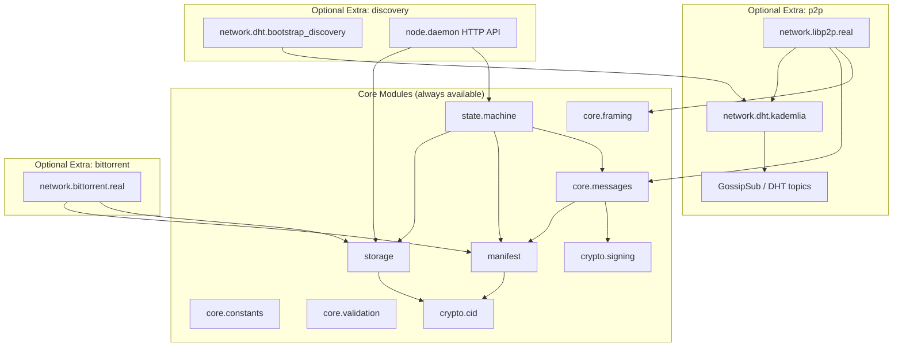
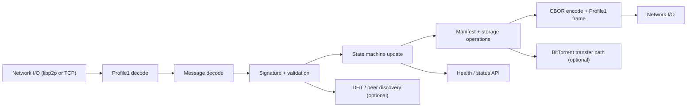

# DCPP Python Implementation

[](https://github.com/meatsquirk/Pypin/actions/workflows/ci.yml)
[](https://pypi.org/project/dcpp-python/)

`dcpp-python` is a Python implementation of the Distributed Content Preservation Protocol (DCPP) wire protocol.

DCPP enables decentralized preservation of content across cooperating nodes. The protocol combines framed request/response messages, canonical CBOR signing, content-addressed manifests, peer discovery, and optional BitTorrent data transfer.

## What This Library Provides

- **Wire Protocol** - Profile 1 envelope framing with CRC32C integrity checks
- **Message Types** - DCPP message structures for HELLO, ANNOUNCE, MANIFEST, PEERS, HEALTH_PROBE, GOODBYE, and related flows
- **Cryptographic Signing** - Ed25519 signatures over canonical CBOR payloads
- **CID Verification** - IPFS-compatible CIDv1 content addressing and verification
- **Storage Backend** - File-system and in-memory storage backends with content verification
- **State Machine** - Node and collection state management for protocol flows
- **Collection Encryption Helpers** - AES-256-GCM primitives and manifest-level encryption metadata

Optional extras add:

- **libp2p Networking** - Real P2P transport with Noise, Kademlia DHT, and GossipSub
- **BitTorrent** - BEP 52-oriented torrent metadata and transfer backend support
- **Bootstrap Discovery + HTTP API** - DNS/IPNS bootstrap support and daemon health/status endpoints

## Quick Start

```bash
# Install the core package
pip install -e .

# Start a local daemon
python -m dcpp_python.node.daemon --listen 0.0.0.0:4001

# Inspect the client CLI
python -m dcpp_python.node.client --help
```

## Installation

### Requirements

- Python 3.9 or higher
- `pip`

### Core Package

```bash
pip install -e .
```

Core dependencies include:

- `cbor2` for canonical CBOR serialization
- `cryptography` for encryption primitives
- `pynacl` for Ed25519 signing

### Optional Extras

```bash
# Development tooling
pip install -e ".[dev]"

# libp2p networking
pip install -e ".[p2p]"

# BitTorrent support
pip install -e ".[bittorrent]"

# Bootstrap discovery and HTTP API helpers
pip install -e ".[discovery]"

# Everything
pip install -e ".[all]"
```

### Platform Notes

```bash
# macOS
brew install openssl

# Ubuntu / Debian
sudo apt-get install libssl-dev python3-dev
```

## Usage Examples

### Create and Frame a HELLO Message

```python
import time

from dcpp_python import Hello, MessageType, Profile1Framer, generate_keypair, derive_peer_id

signing_key, verify_key = generate_keypair()
peer_id = derive_peer_id(verify_key)

hello = Hello(
    version=Hello.DEFAULT_VERSION,
    node_id=peer_id,
    capabilities=["guardian", "seeder"],
    collections=["example:collection"],
    timestamp=int(time.time()),
    user_agent="dcpp-python",
)

frame = Profile1Framer.encode(MessageType.HELLO, hello.to_dict())
```

### Sign Canonical CBOR Payloads

```python
from dcpp_python import generate_keypair
from dcpp_python.crypto.signing import sign_message, verify_signature

signing_key, verify_key = generate_keypair()
payload = {"collection": "example:collection", "coverage": 1.0}

signature = sign_message(payload, signing_key)
assert verify_signature(payload, signature, verify_key)
```

### Compute and Verify a CID

```python
from dcpp_python import compute_cid, verify_cid

content = b"Hello, DCPP!"
cid = compute_cid(content)

assert verify_cid(cid, content)
```

### Store Verified Content

```python
from dcpp_python import FileSystemStorage

storage = FileSystemStorage("./data")
cid, ok = storage.store_verified("example:collection", b"hello world")

assert ok
assert storage.retrieve_verified("example:collection", cid) == b"hello world"
```

## Collection Encryption

Collection encryption is modeled in the manifest layer and implemented with AES-256-GCM helpers in `dcpp_python.crypto.signing`.

- `generate_collection_key()` creates a 32-byte collection key
- `AES256GCM` provides low-level encrypt/decrypt helpers
- `encrypt_content()` and `decrypt_content()` wrap the common content flow
- `EncryptionConfig` in manifests records the algorithm and scope metadata for encrypted collections

Example:

```python
from dcpp_python.crypto.signing import (
    generate_collection_key,
    encrypt_content,
    decrypt_content,
)

key = generate_collection_key()
nonce, ciphertext = encrypt_content(b"secret payload", key)
plaintext = decrypt_content(nonce, ciphertext, key)

assert plaintext == b"secret payload"
```

Current Python support covers cryptographic helpers and manifest metadata. Transport-level encryption is handled separately by libp2p Noise when the `p2p` extra is installed.

## Protocol Messages

Primary DCPP message types include:

| Type | Code | Description |
|------|------|-------------|
| `HELLO` | `0x0001` | Peer introduction and capability exchange |
| `ANNOUNCE` | `0x0002` | Collection availability announcement |
| `GET_MANIFEST` | `0x0003` | Request a collection manifest |
| `MANIFEST` | `0x0004` | Return a collection manifest |
| `GET_PEERS` | `0x0005` | Request peers for a collection |
| `PEERS` | `0x0006` | Return peers for a collection |
| `HEALTH_PROBE` | `0x0007` | Verify a peer still stores content |
| `HEALTH_RESPONSE` | `0x0008` | Return health probe results |
| `GOODBYE` | `0x0009` | Graceful disconnect |
| `ERROR` | `0x00FF` | Structured error response |

The Python implementation also includes membership and administrative flows such as `INVITE`, `JOIN`, `LEAVE`, `REVOKE`, `GET_MEMBERS`, and `MEMBERS`.

## DCPP Architecture Diagrams

### Module Dependencies + Feature Boundaries



### Message Handling Data Flow



## HTTP API

When the daemon HTTP API is enabled, it exposes lightweight operational endpoints:

- `GET /health`
- `GET /health/detailed`
- `GET /api/v1/collections/{collection_id}/status`

The HTTP API is intended for health checks and collection status inspection rather than a full management plane.

## Project Layout

```text
dcpp-python/
├── src/dcpp_python/
│   ├── core/
│   ├── crypto/
│   ├── manifest/
│   ├── network/
│   │   ├── bittorrent/
│   │   ├── dht/
│   │   └── libp2p/
│   ├── node/
│   ├── state/
│   └── storage/
├── examples/
├── docs/
├── pyproject.toml
└── README.md
```

## Troubleshooting

### `py-libp2p` Installation Fails

```bash
pip install --upgrade pip setuptools wheel cython

# Ubuntu / Debian
sudo apt-get install build-essential libssl-dev libffi-dev python3-dev

# macOS
xcode-select --install
brew install openssl
```

### BitTorrent Support Is Missing

```bash
pip install -e ".[bittorrent]"
python3 -c "import torf; print(torf.__version__)"
```

## Documentation

- [Getting Started](docs/getting-started.md)
- [Architecture](docs/architecture.md)
- [API Index](docs/index.md)
- [Protocol Specification](docs/DCPP-RFC-Wire-Protocol.md)

## Contributing

See [CONTRIBUTING.md](CONTRIBUTING.md).

## License

This project is licensed under the MIT License. See [LICENSE](LICENSE).
