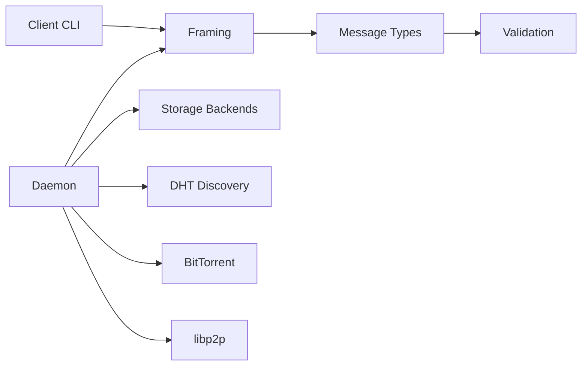
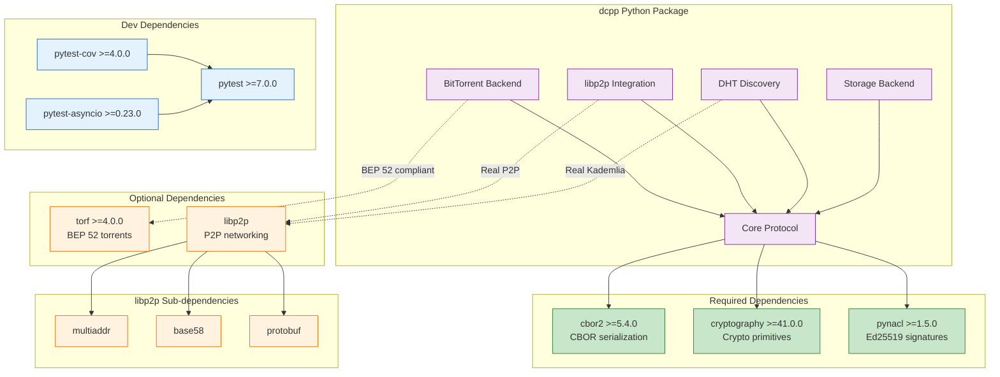

# DCPP Python Implementation

[](https://github.com/meatsquirk/Pypin/actions/workflows/ci.yml)
[](https://codecov.io/gh/meatsquirk/Pypin)
[](https://pypi.org/project/dcpp-python/)

Python proof-of-concept implementation of the Distributed Content Preservation Protocol (DCPP) wire protocol.

## Quick Start

```bash
# Install core package
pip install -e .

# Run tests
python3 -m pytest -m "not benchmark"
```

## Documentation

```bash
pip install -e ".[dev]"
mkdocs serve
```

## Installation

### Prerequisites

- Python 3.9 or higher
- pip (Python package manager)

### Step 1: Install Core Dependencies

```bash
pip install -e .
```

This installs the required dependencies:
- `cbor2>=5.4.0` - CBOR serialization (RFC 8949)
- `cryptography>=41.0.0` - Cryptographic primitives
- `pynacl>=1.5.0` - Ed25519 signatures

### Step 2: Install Dev Dependencies (Optional)

```bash
pip install -e ".[dev]"
```

This adds:
- `pytest>=7.0.0` - Test framework
- `pytest-cov>=4.0.0` - Coverage reporting
- `pytest-asyncio>=0.23.0` - Async test support

### Step 3: Install P2P Networking (Optional)

For real libp2p networking with Kademlia DHT and GossipSub:

```bash
pip install -e ".[p2p]"
```

**Platform-specific notes:**

```bash
# macOS - may need OpenSSL
brew install openssl

# Ubuntu/Debian
sudo apt-get install libssl-dev python3-dev

# Windows - requires Visual C++ Build Tools
```

**Verify installation:**
```bash
python3 -c "from libp2p import new_host; print('libp2p OK')"
```

### Step 4: Install BitTorrent Support (Optional)

For BEP 52 compliant hybrid v1+v2 torrent creation:

```bash
pip install -e ".[bittorrent]"
```

**Verify installation:**
```bash
python3 -c "import torf; print(f'torf {torf.__version__} OK')"
```

### Step 5: Install Discovery + HTTP API (Optional)

For DNS/IPNS bootstrap discovery and HTTP API health endpoints:

```bash
pip install -e ".[discovery]"
```

### Install All Optional Dependencies

```bash
pip install -e ".[all]"
```

## Verification

Run the full verification script:

```bash
python3 << 'EOF'
checks = []

# Core
import cbor2; checks.append("cbor2 OK")
import nacl; checks.append("pynacl OK")

# libp2p
try:
    from libp2p import new_host
    checks.append("libp2p OK")
except ImportError:
    checks.append("libp2p MISSING (P2P networking unavailable)")

# torf
try:
    import torf
    checks.append(f"torf {torf.__version__} OK")
except ImportError:
    checks.append("torf MISSING (will use native BitTorrent backend)")

try:
    import aiohttp
    checks.append("aiohttp OK")
except ImportError:
    checks.append("aiohttp MISSING (HTTP API + discovery limited)")

try:
    import dns.resolver
    checks.append("dnspython OK")
except ImportError:
    checks.append("dnspython MISSING (DNS discovery limited)")

for c in checks:
    symbol = "+" if "OK" in c else "-"
    print(f"  [{symbol}] {c}")
EOF
```

## Running Tests

```bash
# Run all tests
python3 -m pytest -m "not benchmark"

# Run specific test categories
python3 -m pytest tests/e2e/test_interop.py -v           # Interop tests
python3 -m pytest tests/unit/core/test_framing.py -v     # Framing tests
python3 -m pytest tests/unit/core/test_messages.py -v    # Message tests

# Run with coverage
python3 -m pytest tests/ --cov=dcpp_python --cov-report=term-missing

# Run benchmarks
python3 -m pytest -m benchmark --benchmark-only
```

### Interop Tests (Requires Rust)

To run cross-language interoperability tests:

```bash
# Generate test vectors from Rust implementation
cd ..
cargo run --bin generate_test_vectors > dcpp-python/tests/fixtures/test_vectors.json

# Run Python interop tests
cd dcpp-python
python3 -m pytest tests/e2e/test_interop.py -v
```

## Environment Variables

| Variable | Purpose | Default |
|----------|---------|---------|
| `DCPP_STUB_MODE` | Enable stub DHT operations for testing | `1` (enabled) |
| `DCPP_BT_ALLOW_LOCAL` | Allow native BT backend without torf | `1` (allowed) |

**Strict mode** (fail if dependencies missing):
```bash
DCPP_STUB_MODE=0 DCPP_BT_ALLOW_LOCAL=0 python3 -m dcpp_python.node.client hello
```

## Production vs Local-Only Modes

This repository ships a safe local-only path for testing. For production or public networks:

- Use libp2p transport (`.[p2p]`) instead of raw TCP. Raw TCP is for testing only.
- Avoid stub modes: set `DCPP_STUB_MODE=0` to disable stub DHT behavior.
- Use BEP 52 compliant torrents via `torf` (`.[bittorrent]`); local-only hashes are non-compliant.

## Usage Examples

### Start a Client

```bash
# Send HELLO message
python -m dcpp_python.node.client hello

# Get peers for a collection
python -m dcpp_python.node.client get-peers eth:0xBC4CA0

# Health probe
python -m dcpp_python.node.client health-probe eth:0xBC4CA0
```

### Use as a Library

```python
from dcpp_python.core.messages import HelloMessage, MessageType
from dcpp_python.core.framing import Profile1Framer
from dcpp_python.crypto.signing import generate_keypair, sign_message

# Create a message
hello = HelloMessage(
    protocol_version="1.0",
    node_id=b"...",  # 38-byte libp2p PeerId
    capabilities=["announce", "manifest"],
)

# Encode with Profile 1 framing
frame = Profile1Framer.encode(MessageType.HELLO, hello.to_cbor())

# Sign a message
keypair = generate_keypair()
signed_data = sign_message(data_dict, keypair.private_key)
```

## Troubleshooting

### py-libp2p Installation Fails

```bash
# Install build dependencies first
pip install --upgrade pip setuptools wheel
pip install cython

# On Ubuntu/Debian
sudo apt-get install build-essential libssl-dev libffi-dev python3-dev

# On macOS
xcode-select --install
brew install openssl
export LDFLAGS="-L/opt/homebrew/opt/openssl/lib"
export CPPFLAGS="-I/opt/homebrew/opt/openssl/include"
pip install -e ".[p2p]"
```

### torf Import Error

```bash
# Requires Python 3.7+
python3 --version

# Reinstall cleanly
pip uninstall torf
pip install --no-cache-dir "torf>=4.0.0"
```

### Test Vectors Not Found

```bash
# Generate from Rust implementation
cd /path/to/DistributedContentPreservationProtocol
cargo run --bin generate_test_vectors > dcpp-python/tests/test_vectors.json
```

## Project Structure

```
dcpp-python/
├── src/
│   └── dcpp_python/
│       ├── __init__.py
│       ├── core/
│       │   ├── constants.py
│       │   ├── framing.py
│       │   ├── messages.py
│       │   ├── uci.py
│       │   └── validation.py
│       ├── crypto/
│       │   ├── signing.py
│       │   ├── cid.py
│       │   └── peer_id.py
│       ├── network/
│       │   ├── dht/
│       │   ├── libp2p/
│       │   └── bittorrent/
│       ├── storage/
│       │   └── backend.py
│       ├── manifest/
│       │   ├── manifest.py
│       │   └── verify.py
│       ├── state/
│       │   └── machine.py
│       └── node/
│           ├── client.py
│           └── daemon.py
├── tests/
│   ├── fixtures/
│   │   └── test_vectors.json   # Generated test vectors
│   ├── unit/                   # Unit tests
│   ├── integration/            # Integration tests
│   └── e2e/                    # End-to-end tests
├── examples/
│   ├── hello_node.py
│   ├── collection_guardian.py
│   ├── manifest_creation.py
│   ├── health_probing.py
│   └── custom_storage.py
├── pyproject.toml
└── README.md
```

## Architecture Overview



## Dependency Diagram


