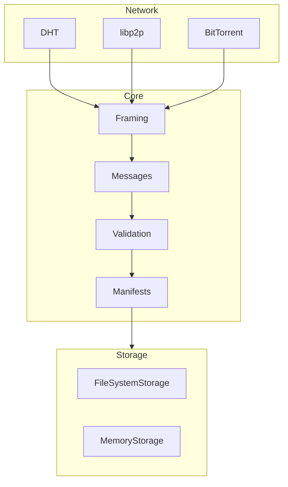

# Architecture

DCPP Python is organized around a small set of core protocol components with optional integrations.

```mermaid
flowchart TB
    subgraph Core
        FRAMING[Framing]
        MESSAGES[Messages]
        VALIDATION[Validation]
        MANIFESTS[Manifests]
    end

    subgraph Storage
        FS[FileSystemStorage]
        MEM[MemoryStorage]
    end

    subgraph Network
        DHT[DHT]
        LIBP2P[libp2p]
        BT[BitTorrent]
    end

    FRAMING --> MESSAGES
    MESSAGES --> VALIDATION
    VALIDATION --> MANIFESTS
    MANIFESTS --> Storage
    DHT --> FRAMING
    LIBP2P --> FRAMING
    BT --> FRAMING
```
